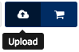

# FIDASH deployment documentation

## Introduction

The document describes the installation of the FIDASH component, the modification and creation of dashboards, the permissions needed to operate with the different services, and other technical details relevant of the usage of the component.

## Installation of the environment

FIDASH environment at the time of writing is executed inside public WireCloud instance in FIWARE Lab at [https://mashup.lab.fiware.org](https://mashup.lab.fiware.org).

> In the future FIDASH will require a customized version of WireCloud. This document will be updated to describe the required steps to include the installation of such custom WireCloud instance together with the configurations and customizations required.

> Since a public instance, and not a dedicated one, is being used at the time of writing, FIDASH currently requires the user to manually upload widgets to its own set of resources inside [https://mashup.lab.fiware.org](https://mashup.lab.fiware.org) following the instructions described below.

### Uploading widgets

Widgets must be packaged as zip-compressed files using `.wgt` extension to be uploaded in FIDASH, however their package they can be downloaded from repositories or created from the source code. To upload widgets, go to the **My Resources** section inside [WireCloud public instance](https://mashup.lab.fiware.org), click on **Upload** button and then drag all the desired widgets.

 

Widgets can now be found on the **My Resources** section, where user can see the details such as their version and delete or manage existing widgets. However, widgets are not yet instantiated in any dashboard or mashup.

Please note the _back_ button (left arrow at the left of the name of dashboard or WireCloud tool such as _My Resources_) on the _My Resources_ page or other inside FIDASH for going back. It is required getting back using it instead of using browser functionality for previous page.

> At the time of writing widgets are available as `.wgt` files in the [developers repository manager](https://repo.conwet.fi.upm.es/artifactory/webapp/browserepo.html), under the `widget-release` folder. According to FIWARE developer guidelines, binaries and source code are being migrated to GitHub and will be available under the [FIDASH organization at GitHub](https://github.com/fidash).

## Permissions

Since FIDASH is composed by widgets with multi-region capabilities, you should have access to all the region you need to monitor or to manage; in addition a special access is requires to access SLAManager API.

### Obtaining multi-region access

There are different types of FIWARE accounts:

* Basic: This is the default account that is created, though it does not have access to the cloud unless promoted to trial
* Trial: Basic account with access to Cloud. It expires in 14 days. Currently, at FIWARE events, special instructions
* Community, required for account not expiring. It is requested in an [http://forge.fiware.org/plugins/mediawiki/wiki/fiware/index.php/FIWARE_Lab:_Upgrade_to_Community_Account](application), indicating you require, for FIDASH usage, access to all the regions you need.

### Obtaining SLAManager access

### Obtaining monitoring access 

