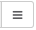
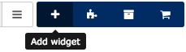
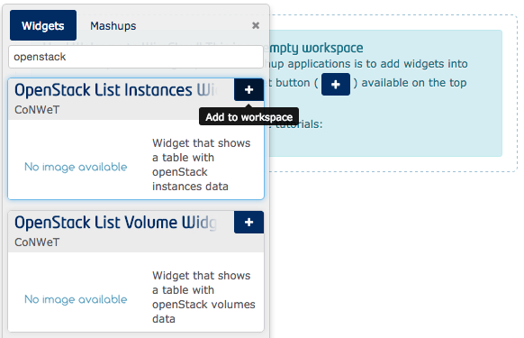
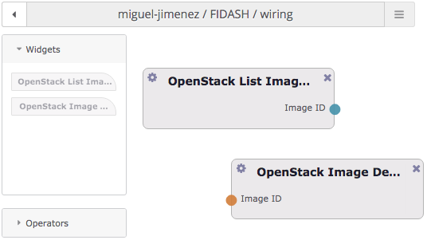
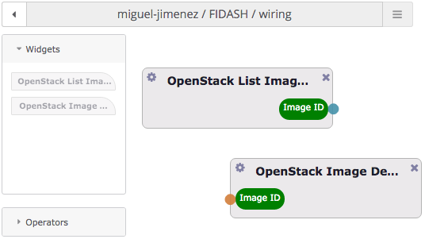

# FIDASH deployment documentation

## Introduction

The document describes the installation of the FIDASH component, the modification and creation of dashboards, the permissions needed to operate with the different services, and other technical details relevant of the usage of the component.

## Installation of the environment

FIDASH environment at the time of writing is executed inside public WireCloud instance in FIWARE Lab at [https://mashup.lab.fiware.org](https://mashup.lab.fiware.org).

> In the future FIDASH will require a customized version of WireCloud. This document will be updated to describe the required steps to include the installation of such custom WireCloud instance together with the configurations and customizations required.

> Since a public instance, and not a dedicated one, is being used at the time of writing, FIDASH currently requires the user to manually upload widgets to its own set of resources inside [https://mashup.lab.fiware.org](https://mashup.lab.fiware.org) following the instructions described below.

### Uploading widgets

Widgets must be packaged as zip-compressed files using `.wgt` extension to be uploaded in FIDASH, however their package they can be downloaded from repositories or created from the source code. To upload widgets, go to the **My Resources** section inside [WireCloud public instance](https://mashup.lab.fiware.org), click on **Upload** button and then drag all the desired widgets.

 

Widgets can now be found on the **My Resources** section, where user can see the details such as their version and delete or manage existing widgets. However, widgets are not yet instantiated in any dashboard or mashup.

Please note the _back_ button (left arrow at the left of the name of dashboard or WireCloud tool such as _My Resources_) on the _My Resources_ page or other inside FIDASH for going back. It is required getting back using it instead of using browser functionality for previous page.

> At the time of writing widgets are available as `.wgt` files in the [developers repository manager](https://repo.conwet.fi.upm.es/artifactory/webapp/browserepo.html), under the `widget-release` folder. According to FIWARE developer guidelines, binaries and source code are being migrated to GitHub and will be available under the [FIDASH organization at GitHub](https://github.com/fidash).

## Dashboard creation

An existing mashup or a new one (accessible from the mashup menu button ) shall be used.

### Instantiate widgets

In the desired work-space, click the plus button for adding widgets is to be used.

The available widgets will appear in a left-sliding window. Another add button is available at each widget header so as to add it to the current workspace.

Widgets appear with a default size and in the best available empty space inside the workspace. Please be aware of the tab functionality at the bottom of the page, in case big dashboards are desired. Widget size and position can be changed and adjusted using its window controls (bottom-left and right corner to resize and title bar to drag).

### Defining behaviour through wiring

FIDASH widgets communicate among themselves so as to create a composite application made up from the collaboration of the different widgets instantiated in a dashboard. Widgets generate events containing data of items of interaction (mainly identifiers of VMs, volumes, etc), and what other widgets receive such events and act accordingly (e.g. showing the details of the received VM id) is decided by the dashboard user defining the wiring among the widgets. This is done on the **wiring tool**, that is accessible through its icon:

On the wiring tool, all the widgets deployed on the dashboard appear at the leftmost side of the screen. These elements are to be dropped on the middle panel so as to define the wiring (namely connect output endpoints with input endpoints).

As they are at the center panel, input and output endpoints of the widgets are shown. Input endpoints are shown as orange circles at the left of the widgets, whereas output endpoints are green circles at the right side of them.

If the user wants that an event generated at a given widget (for example, after she clicking on an VM image ID in a table) is reproduced on some other widget (e.g. showing the details of that image) she has to drag the corresponding output endpoint to the corresponding input endpoint. In case multiple input and output endpoints, or when their related actions are not easily understood by the simple description, the documentation of the widget describes precisely those actions and effects.

It is noteworthy indicating that the selection of a certain endpoint highlights the compatible endpoints that can be connected with the one selected. In FIDASH this implies that choosing an endpoint outputting an image ID highlights the input endpoints where an image ID is expected. Due to the open nature of the WireCloud wiring technology, it is not a constraint, and a user can decide to connect different types of events at his own risk (since they do only send text data), but the result might not be satisfactory.

Finally, the created wire appears as a pipe linking both endpoints, what implies that whenever the widget source of the event produces it, the event with the associated data is immediately taken by the platform to the consumer of that event.

The input and output endpoints can have as many wires connected as desired, allowing the user to completely define the behaviour of her dashboard.

### Basic widget connections

Created widgets for FIDASH are designed maximizing the input and output endpoints that those widgets can handle. This is done so as to provide the maximum flexibility to FIDASH users. However, there are typical connections that are the basis for most dashboards.

All the widgets related to OpenStack services are divided into two categories, listing widgets and detail widgets. Listing widgets show list of images, volumes, etc, plus some basic information, and rely on detail widgets for showing further information. These pairs of widgets are to be connected together (in case a user wants to deploy both on her dashboard). But nonetheless some of them offer some further functionality (e.g. ListInstance or InstanceDetail widgets can generate image ID events, that the user can wire to the same or other instance of ImageDetail in case she wants to make use of that option).

## Permissions

Since FIDASH is composed by widgets with multi-region capabilities, you should have access to all the region you need to monitor or to manage; in addition a special access is requires to access SLAManager API.

### Obtaining multi-region access

### Obtaining SLAManager access

### Obtaining monitoring access 

## Other considerations

Widget can work without major problems with HTTP connection, but please be aware that this can create a security problem. For HTTPS connection could be needed that the server sends some HTTP Headers to enable the 
visualization of the data or to relax some policies (e.g. [Same-origin policy](https://en.wikipedia.org/wiki/Same-origin_policy) ).

In modern browsers, linking to an HTTP resource from an HTTPS page is forbidden and a slight notice might be shown by the browser (Firefox and chrome show a shield icon next to the address bar) to allow these kind of connections. During the development of FIDASH and the associated back-end services, some HTTP services might be used, and user should allow these types of connections manually (by clicking on that shield in the case of Firefox and chrome).

WireCloud is tested on Firefox and chrome browsers. Other browsers supporting HTML5 standards will probably be 100% compatible, but it is not guaranteed.

