# FIDASH User Guide

### Users and permissions

Users should be able to log in FIDASH platform at [https://dash.lab.fiware.org](https://dash.lab.fiware.org) using their own FIWARE Lab user. In case a user does not have a FIWARE Lab user, it should be requested at the [IdM GE](https://account.lab.fiware.org/). User roles and permissions are inherited from the ones they do have on the cloud portal or assigned on FIDASH application for administration purposes. Issues with user rights should be addressed to [fiware-tech-help@lists.fiware.org](mailto:fiware-tech-help@lists.fiware.org) clearly indicating *FIDASH* as the destination of the request.

# Dashboard creation and editing

## Using a pre-created dashboard

FIDASH comes with pre-created dashboards that can be instantiated and used in seconds. To do this, button 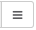 shall be used to create a new dashboard. In the template-selection screen, click the search button, and all the available dashboards will appear.

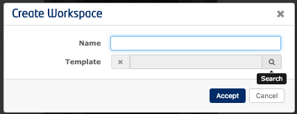

Select button of the desired dashboard is to be clicked. If no name is specified, new workspace will be created with the name of the dashboard.

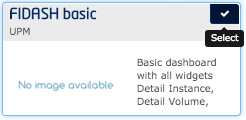

## Dashboard customization

An existing mashup or a new one (accessible from the mashup menu button ) shall be used.

The firts time the user tries to log into FIDASH she will be requested to allow access to the application FIDASH.

> Sometimes, this authorization requests does not appear, and the access to FIDASH platform must be retried. And sometimes IdM does not return to FIDASH after authorization, so it has to be done by user browsing again to [https://dash.lab.fiware.org](https://dash.lab.fiware.org).

The main view of FIDASH is an empty dashboard where the user can create her own dashboard from scratch. However, the fastest way to start is instantiating a previously created dashboard, as explained below. The user is able to create multiple dashboards, to modify them (even the ones created instantiating a existing one), or to create themo from scratch.

In any case, the button for all of the dashboard-related tasks, including accessing existing ones, deleting, creating new ones or accessing their settings is this one: 

### Instantiate dashboards

In case a previously created dashboard is to be used, either by having been created by the user, uploaded by her or it is a publicly available dashboard, as they are on the platform.

In FIDASH, dashboards appear as mashups in the **My Resources** section. 

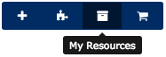

Clicking on _My Resources_ button takes the user to the full list of resources, where some of them are labeled with the tag **mashup**. Those are the dashboards that can be instantiated. 

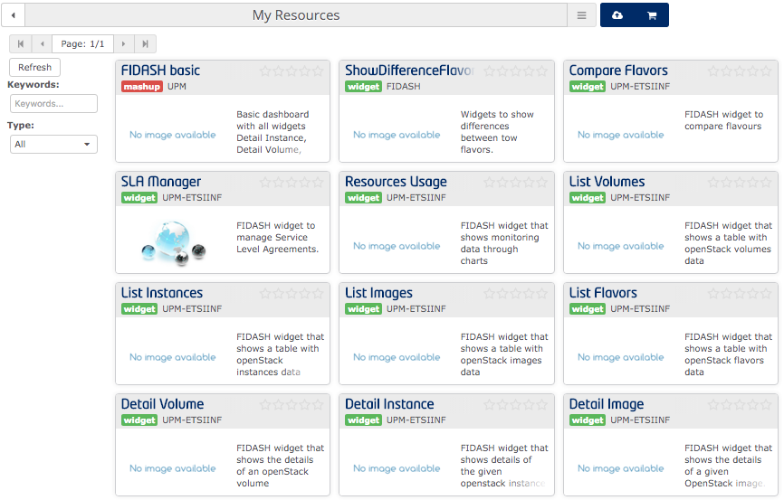

Documentation of widgets, operators and mashups is accessible on that screen by clicking on any of them.

In case the user wants to deploy one of the dashboards (the mashups), she must back to the dashboard view, use the menu button () and chooose **New workspace** option. In next window, a lookup icon displays the list of mashups (the dashboards), and the user does only have to choose one of them by clicking on the select button.

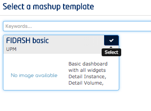

If no name is specified, the new dashboard will inherit the name of the mashup. In any case, it will appear on the list of workspaces accessible through the  button.

This dashboard can be customized as the user wishes:

* Size of the widgets can be changed dragging the lower-right corner of them
* Position of the widgets can be changed by clicking on the top bar of them
* Widgets may have some options accessible through their settings menu that appears when the mouse stops over the top-right corner of the widget 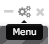

User can also remove widgets (cross next to the options menu of the widget), add new widgets or modify the behaviour through wiring. Next sections describe the latter options in detail.

### Instantiate widgets

In the desired work-space, click the plus button for adding widgets is to be used.

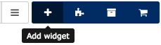

The available widgets will appear in a left-sliding window. Another add button is available at each widget header so as to add it to the current workspace.

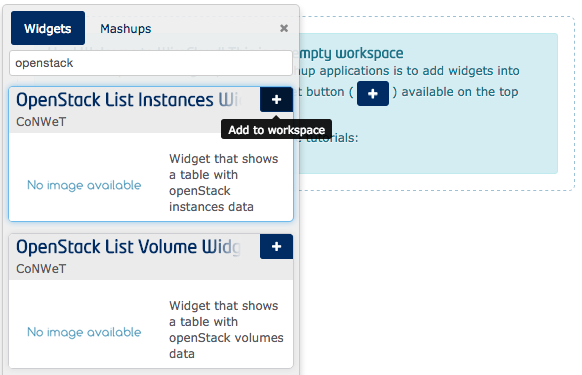

Widgets appear with a default size and in the best available empty space inside the workspace. Please be aware of the tab functionality at the bottom of the page, in case big dashboards are desired. Widget size and position can be changed and adjusted using its window controls (bottom-left and right corner to resize and title bar to drag).

### Defining behaviour through wiring

FIDASH widgets communicate among themselves so as to create a composite application made up from the collaboration of the different widgets instantiated in a dashboard. Widgets generate events containing data of items of interaction (mainly identifiers of VMs, volumes, etc), and what other widgets receive such events and act accordingly (e.g. showing the details of the received VM id) is decided by the dashboard user defining the wiring among the widgets. This is done on the **wiring tool**, that is accessible through its icon:

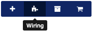

On the wiring tool, all the widgets deployed on the dashboard appear at the leftmost side of the screen. These elements are to be dropped on the middle panel so as to define the wiring (namely connect output endpoints with input endpoints).

As they are at the center panel, input and output endpoints of the widgets are shown. Input endpoints are shown as orange circles at the left of the widgets, whereas output endpoints are green circles at the right side of them.

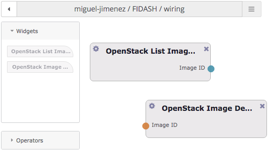

If the user wants that an event generated at a given widget (for example, after she clicking on an VM image ID in a table) is reproduced on some other widget (e.g. showing the details of that image) she has to drag the corresponding output endpoint to the corresponding input endpoint. In case multiple input and output endpoints, or when their related actions are not easily understood by the simple description, the documentation of the widget describes precisely those actions and effects.

It is noteworthy indicating that the selection of a certain endpoint highlights the compatible endpoints that can be connected with the one selected. In FIDASH this implies that choosing an endpoint outputting an image ID highlights the input endpoints where an image ID is expected. Due to the open nature of the WireCloud wiring technology, it is not a constraint, and a user can decide to connect different types of events at his own risk (since they do only send text data), but the result might not be satisfactory.

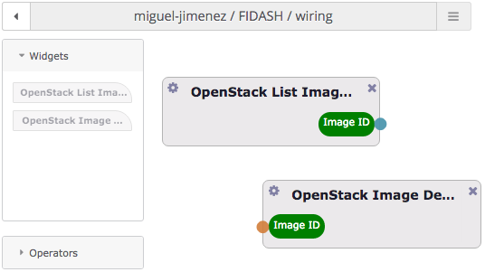

Finally, the created wire appears as a pipe linking both endpoints, what implies that whenever the widget source of the event produces it, the event with the associated data is immediately taken by the platform to the consumer of that event.

The input and output endpoints can have as many wires connected as desired, allowing the user to completely define the behaviour of her dashboard.

### Basic widget connections

Created widgets for FIDASH are designed maximizing the input and output endpoints that those widgets can handle. This is done so as to provide the maximum flexibility to FIDASH users. However, there are typical connections that are the basis for most dashboards.

All the widgets related to OpenStack services are divided into two categories, listing widgets and detail widgets. Listing widgets show list of images, volumes, etc, plus some basic information, and rely on detail widgets for showing further information. These pairs of widgets are to be connected together (in case a user wants to deploy both on her dashboard). But nonetheless some of them offer some further functionality (e.g. ListInstance or DetailInstance widgets can generate image ID events, that the user can wire to the same or other instance of DetailImage in case she wants to make use of that option).

An example of connections of a simple dashboard containing one instance of every widget would be the one shown in the image below. In this case, Detail image would display the details of an image clicked on the details of an instance, on the list of instances (has a image column) or on the list of images.

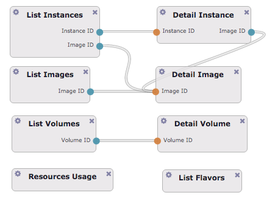

### Publishing your own dashboard

Once a dashboard is created, having settled the desired layout, the wiring, the properties, etc., it can be saved for the future, of for sharing with other users. This can be done by clicking on the menu button () and choosing _Upload to my resources_. User must indicate vendor, version number, email, and some brief description. On other tabs an icon can be added (170x80 px), and some other options such as block the widgets in the mashup, block the connections, or embed the widgets or operators inside the dashboard (not only linking them by reference).

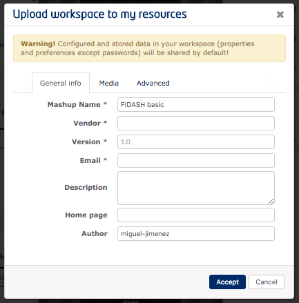

After uploading the dashboard, **My Resources** section will display a new resource with the chosen name. This dashboard can be instantiated or downloaded (to be shared with others).

# Usage of components

## Flavor Sync

Glance Sync functionality is composed of two widgets:

* **Compare Flavors**: It lists reference flavors on the left, and flavors of the current region on the right. The current region is chosen among the ones that the user is _infrastructure owner_. User can select one flavor on each column, and according to that selection, the widget allows the user to:
	* copy  (left-column selected to current region)
	* replace  (right-columnt selected with left-column selected)
	* delete 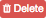 (right-columnt selected)

	Besides, widget eases the task of comparing by hiding  the flavors that are compatible on the left and on the right. And the selections can be cleared .
	
	

* **Show flavor differences**: with the widgets selected on **compare flavors** widget, this one shows their details highlighting the differences.
 
    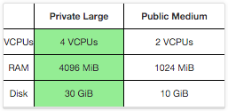

## Maintennance calendar

Calendar widget is a horizontal-based timeline, where each region is placed on a different row, plus one for no-maintennance requests. Users must have proper rights to create events on a certain row, by veing infrastructure owner or the region or by being designated as authorized for creating no-maintenance requests. Roles in grey color are not writtable by the user, whereas he does have permission to write on white ones. A regular lab user shall see all the calendar marked in grey.

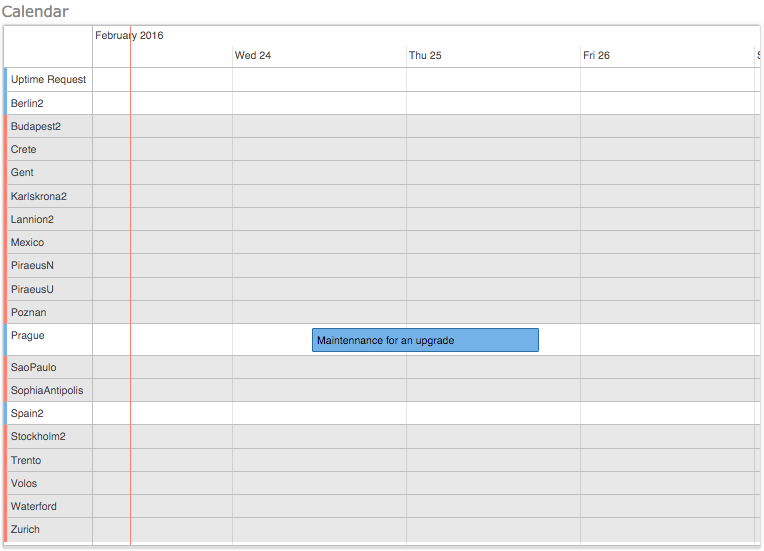

By _double clicking_ on the specified row (whenerer user is authorized), a modal dialog appears to enter details. Textual description must be written here, but timing can be stablished back on the calendar. By _clicking_ on an event that the user can modify, interface changes being able to delete it or, more important, drag edges to the desired values for modifying start and end date and time.

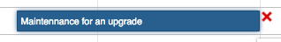

Another interesting feature is the **zooming** function. By clicking _shift_ key while using the scroll, horizontal zooming happens, allowing to select the time-frame to be shown. Calendar can be also dragged horizontally to move on the current zoom level. Zooming function ranges from years to hours level.

### Exporting to ICS

FITOOKIT did create the backend, and a public ICS calendar is exported with the events of every region in a single calendar. This calendar, accessible at URL [http://130.206.113.159:8085/api/v1/ics/maintenanceCalendarFiwareLab](http://130.206.113.159:8085/api/v1/ics/maintenanceCalendarFiwareLab), can be integrated in Outlook, Thunderbird, OS X's Calendar, Google Calendar, etc. This would be the basic instructions for integrating the calendar:

* Microsoft Outlook: On Calendar Ssection, `Open calendar` -> `From Internet`, and paste the URL
* OS X's Calendar: Click on `File` -> `New calendar subscription...` and paste the URL
* Google Calendar: Go to calendar setiings, and click on the link `Browse interesting calendars` which is located below the list of personal calendars. On next screen click on `Add by URL` and paste the URL.

    > Google Calendar does refresh external ICSs on an un-specified frequency that seems to be around 24 hours.

## Monitoring

### Monitoring regions

General data about different regions is shown in **Monitoring Regions** widget. It shows virtual CPUs, RAM, disk space and public IPs in a percentage ratio of total/used and a circular graph. It does also indicate real values on tooltip when mouse is over a graph. For CPU and RAM usage, virtual values (applied the overcommit ratio) are shown.

Widget is flexible in two ways:

* it allows choosing one or many regions, via its region selector or receiving them by wiring from the **region selector widget**. Each region is shown in a specific card, and those cards are arranged in columns automatically according to the vertical and horizontal space of widget vs cards.
* it allows user to focus on the desired measures (vCPU, RAM, disk and IP addresses). It works together with the selection of regions, and allows for a flexible creation of specific purpose views.

It's worth saying that the widget, as all of them, can be instantiated multiple times, focusing a given instance on a specific purpose, such as global status of computing or free IP addresses, or monitoring of the set of regions of interest (e.g. the ones hat are hosting one application).
